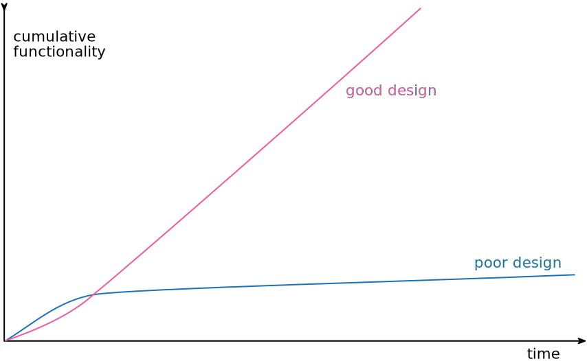

# Chapter 2 - Principles in Refactoring

## Defining Refactoring

__Refactoring__ (noun): a change made to the internal structure of software to make it easier to understand and cheaper
to modify without changing its observable behavior.

__Refactoring__ (verb): to restructure software by applying a series of refactorings without changing its observable
behavior.

[Canon TDD](https://tidyfirst.substack.com/p/canon-tdd) 를 할 때 테스트 시나리오 목록에서 구현할 순서를 정하는 것이 경험에서 우러나오는 중요한 스킬이라 하는데 이와 비슷한 맥락에서 작은 리팩토링 단계들을 엮어서 원하는 큰 구조 변경을 일으키는 노하우가 궁금하다.

## The Two Hats

When using refactoring to develop software, divide time between two distinct activities: adding functionality and refactoring.

## Why Should We Refactor?

### Refactoring improves the design of software

### Refactoring makes software easier to understand

### Refactoring helps me find bugs

### Refactoring helps me program faster

이 중 리팩토링이 프로그래밍 속도를 높이는 효과를 Design Stamina Hypothesis 이라고 부른다.

## When Should We Refactor?

- Preparatory refactoring--making it easier to add a feature
- Comprehension refactoring: making code easier to understand
- Litter-pickup refactoring
- Planned and opportunistic refactoring
- Long-term refactoring
- Refactoring in a code review
- What do I tell my manager?
- When should I not refactor?

라이브러리를 교체하는 것과 같은 규모가 큰 리펙토링도 되도록이면 점진적으로 진행한다. 두 라이브러리에 대한 인터페이스 역할을 할 수 있는 추상화를 사용한다. 이 전략을 [Branch by abstraction](https://martinfowler.com/bliki/BranchByAbstraction.html) 라 한다.

코드 리뷰에 리팩토링을 접목하는 방법으로 필자는 pull request model 을 권장하지 않는다. 대신 pair programming을 추천한다.

인상적이고 (아쉽게도) 실용적인 조언이 코드베이스의 건강 상태가 생산성에 미치는 영향을 모르는 관리자에게는 "리팩토링한다고 말하지 말라"는 조언이다. 그리고 그 이유는 소프트웨어 개발자는 프로다라는 것이다. 프로 개발자의 역핧은 효과적인 소프트웨어를 최대한 빨리 만드는 것이다. 단지 언제든지 예상치 못한 요구 사항이나 장에 대응이 필요할 수 있기에, 작은 단위의 리팩토링으로 코드가 깨지지 않게 유지하는 것이 중요하다는 생각이 든다.

마지막으로 수정할 필요가 없는 코드는 리팩토링하지 않는다. 리팩토링하는 것보다 처음부터 새로 작성하는 것이 쉬울 때도 리팩토링하지 않는다.

## Problems with Refactoring

### Slowing down new features

The point of refactoring isn't to show how sparkly a code base is -- it is purely economic.

### Code ownership

Many refactorings involve making changes that affect not just the internals of a module by its relationships with other parts of a system.

Code ownership boundaries get in the way of refactoring because I cannot make the kinds of changes I want without breaking my clients.

I recommend against fine-grained strong code ownership. A more permissive ownership can exist across teams.

### Branches

With Continuous Integration (CI), also known as Trunk-Based Development, each team member integrates with mainline at least once per day. The dominant reason to favor CI is that it's far more compatible with refactoring.

### Testing

One of the key characteristics of refactoring is that it doesn't change the observable behavior of the program. I shouldn't break anything -- but what if I make a mistake? The key here is being able to catch an error quickly.

### Legacy code

Refactoring can be a fantastic tool to help understand a legacy system. If you have a big legacy system with no tests, you can't safely refactor it into clarity. Usually, a system is only easy to put under test if it was designed with testing in mind.

Get a copy of _Working Effectively with Legacy Code_ and follow its guidance. To summarize crudely, it advises you to get system under test by finding seams in the program where you can insert tests.

### Databases

Evolutionary database design and database refactoring are widely used. The essence of the technique is to combine the structural changes to a database's schema and access code with data migration scripts that can easily compose to handle large changes.

One difference from regular refactorings is that database changes often are best separated over multiple releases to production.

## Refactoring, Architecture, and Yagni

The real impact of refactoring on architecture is in how it can be used to form a well-designed code base that can respond gracefully to changing needs.

With refactoring, you can use refactoring to adapt the architecture to users' needs. This approach to design goes under various names: simple design, incremental design, or [yagni](https://martinfowler.com/bliki/Yagni.html).

## Refactoring and the Wider Software Development Process

The first foundation for refactoring is self-testing code.

To refactor on a team, it's important that each member can refactor when they need to without interfering with others' work. With CI, each member's refactoring efforts are quickly shared with their colleagues.

With self-testing code, continuous integration,, and refactoring in place, we enable the Yagni approach.

## Refactoring and Performance

Refactoring can certainly make software go more slowly -- but it also makes the software more amenable to performance tuning. The secret to fast software, in all but hard realtime context, is to write tunable software first and then tune it for sufficient speed.

An approach to writing fast software using refactoring is to first build my program in a well-factored manner without paying attention to performance until I begin a deliberate performance optimization exercise.

## Where Did Refactoring Come From?

Two of the first people to recognize refactoring as a key element in the whole process of software development were Ward Cunningham and Kent Beck, who worked with Smalltalk from 1980s onward.

## Automated Refactorings

To do refactoring properly, the tool has to operate on the syntax tree of the code, not on the text.

The tool also needs to figure out how to rerender the code into text back in the editor window.

Many refactorings are made much safer when applied in a language with static typing.
