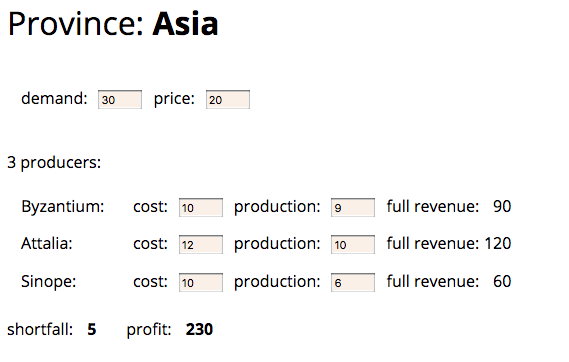

# Chapter 4 - Building Tests

## The Value of Self-Testing Code

> - Make sure all tests are fully automatic and that they check their own results.
> - A suite of tests is a powerful bug detector that decapitates the time it takes to find bugs.

TDD approach to programming relies on short cycles of writing a (failing) test, writing the code to make that test work,
and refactoring to ensure the result is as clean as possible.

## Sample Code to Test

1장 예제도 그렇듯이 예제 코드가 일반적인 레이어드 아키텍처 구성이나 객체지향 설계와 잘 맞지 않는 느낌이라 코틀린으로 작성하면서 찜찜한 감이 들었다. 웹 폼에서 넘어오는 DTO와 도메인 엔티티가 짬뽕되어 있고 각
속성마다 getter와 setter 가 덕지덕지 발라져 있다. 물론 저자의 의도는 UI와 비즈니스 로직을 간단한 HTML과 Javascript로만 제시하여 영속성이나 네트워크 통신과 같은 인프라를 생각하지
않아도 되게 하는 것과 자동화된 자가 테스트를 소개하는 것이기에 적절한 예제일 수도 있다고 생각한다.

## A First Test

> Always make sure a test will fail when it should.

예제에서 의도적으로 오류를 작성해서 의미 있는 테스트인지 검증하는 점이 인상 깊었다. TDD를 할 경우 자연스럽게 하게 되는 것이지만 실제 작성한 테스트가 유효한지 알기 위해서는 중요한 절차라 생각한다.

## Add Another Test

테스트 프레임워크 lifecycle hooks를 사용해서 중복되는 테스트 픽스쳐 마련하는 것을 간소화한다.

## Modifying the Fixture

사실 setter를 사용해서 테스트 픽스쳐를 수정하는 부분은 조금 그런 것 같다. 코틀린에서는 함수의 default argument들을 제공할 수 있기에 차라리 테스트 픽스쳐를 (정적) 팩토리 메서드로 만드는 것이 DAMP (Descriptive And Meaningful Phrases)한 테스트 코드 작성에 더 적합하다고 생각한다.

Setup-exercise-verify, given-when-then, arrange-act-assert 로 되어있는 테스트의 단계들은 잘 알고 있었는데 teardown이라는 암묵적인 단계도 있다는 점을 생각하게
되었다.

## Probing the Boundaries

> Think of the boundary conditions under which things might go wrong and concentrate your tests there. 

단지 empty string demand와 string for producers 테스트 케이스는 정적 타입이 있는 언어를 사용하고 있어서 테스트하기 애매해졌다. Validation 로직의 위치에 대해 고민해보면 좋을 것 같다. 

## Much More Than This

> When you get a bug report, start by writing a unit test that exposes the bug.

How much testing is enough? Test coverage analysis is only good for identifying untested areas of the code, not for assessing the quality of a test suites.

If I can refactor my code and be pretty sure that I've not introduces a bug because my tests come back green-then I can be happy that I have good enough tests.
