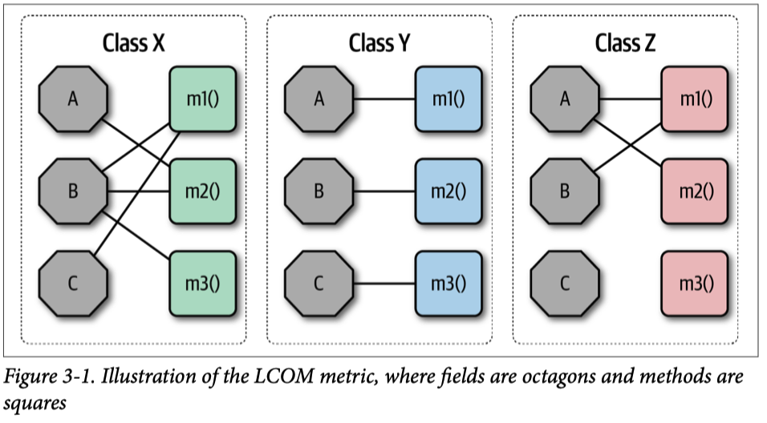
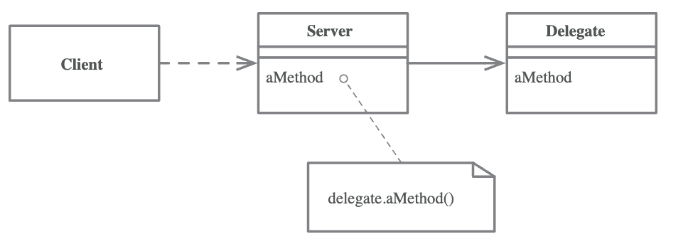

# 7. Encapsulation

코틀린으로 예제들을 학습하고 있는데 여전히 책의 예제들이 Javascript로 되어 있는 부분이 아쉽다. Object literal 사용과 암묵적인 null 사용으로 책의 리팩토링 단계들이 잘 적용이 안 될 때가
있다 (물론 아직 idiomatic 코틀린에 덜 익숙하다). Object literal을 data class로 변경할지 Map으로 작성해야 할지 고민이 되었다.
예제들에서 자주 getter/setter 사용하는 것도 조금 어색한 느낌이긴 한데 생각해보니 결국 까보면 그런 행위가 메서드들 안에서 이루어지니 적합하다는 생각이 든다. 불변객체 사용에 대한 이야기도 종종 나오고
있는데 코틀린에서는 컬렉션을 사용할 때 변경할 수 있는지 제한하는 인터페이스가 있기에 책에서 나온 내용이 자동으로 적용되는 예제들도 있었던 것 같다. 일괄적으로 run static checks라는 단계도
compile error가 다 잡아줄 것 같다.

Perhaps the most important criteria for decomposing modules is to identify secrets that modules should hide from the
rest of the system.

Hide data structures by

- _Encapsulate Record_
- _Encapsulate Collection_

Even primitive data types can be encapsulated with _Replace Primitive with Object_.

Use _Replace Temp with Query_ for temporary variables that get in the way of refactoring.

Form classes with _Combine Functions into Class_. Extract/inline operations also apply to classes with _Extract Class_
and _Inline Class_.

To hide connections between classes, use _Hide Delegate_. If too much hiding leads to bloated interfaces, reverse with
_Remove Middle Man_.

Functions also encapsulate their implementation. Make wholesale change to an algorithm by wrapping it in a function with
_Extract Function_ and _Substitute Algorithm_.

## Encapsulate Record

### Motivation

Simple records have disadvantages: they separate what is stored in the record from calculated values.

Often favor objects over records for mutable data. For immutable value, can use an enrichment step if necessary.

Two kinds of record structures: those where I declare legal field names and those like hash, map, hashmap, dictionary,
or associate array.

### Mechanics

1. _Encapsulate Variable_ on the variable holding the record.
2. Replace the content of the variable with a simple wrapper for the record. Modify the functions that encapsulate the
   variable to use accessors.
3. Test
4. Provide new functions that return the object.
5. For each user of the record, replace the function that returns the record with one that returns the object.

- If it's a complex record, focus on clients that update the data first.

6. Remove the class's raw data accessors and the functions that returned the raw record.
7. Test
8. If the fields of the records are structures, consider using _Encapsulate Record_ and _Encapsulate Collection_
   recursively.

개인적으로 코틀린으로 _Encapsulating a Nested Record_를 적용하는 부분이 상당히
어색했는데 [Refactoring Code to Load a Document](https://martinfowler.com/articles/refactoring-document-load.html)라는 글을
읽어야겠다.

## Encapsulate Collection

객체지향을 처음 배울
때 [The Thoughworks Anthology](https://www.amazon.com/ThoughtWorks-Anthology-Technology-Innovation-Programmers/dp/193435614X)
에 실려있는 Object Calisthenics를 따랐다. 현업에서 적용하기에는 극단적일 수 있지만 그 중, Rule 8: Use First-Class Collections 글이
있다. [일급 컬렉션 (First Class Collection)의 소개와 써야할 이유](https://jojoldu.tistory.com/412)에 더 자세히 설명되어 있다.

### Motivation

If getter for a collection returns itself, then that collection's membership can be altered by the client.

Provide collection modifier methods-usually `add` and `remove`-on the class itself.

Another way is to allow some form of read-only access to the collection.

Probably the most common approach is to provide a getting method for the collection, but make it return a copy of the
underlying collection.

### Mechanics

1. _Encapsulate Variable_ on the collection.
2. Add functions to add and remove elements from the collection.
3. Run static checks.
4. Find all references to the collection. If anyone calls modifiers on the collection, change them to use the new
   add/remove functions. Test after each change.
5. Modify the getter for the collection to return a protected view on it.
6. Test.

## Replace Primitive with Object

Object Calisthenics의 Rule 3: Wrap All Primitives and Strings.

### Motivation

As development proceeds, simple items represented by simple date items, such as numbers or strings, aren't so simple
anymore.

I like to create a new class for that bit of data. I have a place to put behavior specific to its needs.

### Mechanics

1. _Encapsulate Variable_.
2. Create a simple value class for the data value. It should take the existing value in its constructor and provide a
   getter for that value.
3. Run static checks.
4. Change the setter to create a new instance fo the value class and store that in the field, changing the type of the
   field if present.
5. Change the getter to return the result of invoking the getter of the new class.
6. Test.
7. Consider using _Rename Function_ on the original accessor to better reflect what they do.
8. Consider clarifying the role of the new object as a value or reference object by applying _Change Reference to Value_
   or _Change Value to Reference_.

## Replace Temp with Query

거의 사용해본 적이 없는 기법인데 1장 예제에서 봤듯이 긴 함수를 쪼개는 데 유용할 것 같다.

### Motivation

If I'm working on breaking up a large function, turning variables into their own function makes it easier to extract
parts of the function.

Only some temporary variables are suitable. The variable needs to be calculated once and then only be read afterward.

### Mechanics

1. Check the variable is determined entirely before it's used, and the code that calculates it does not yield a
   different value whenever it is used.
2. If the variable can be made read-only, do so.
3. Test.
4. Extract the assignment of the variable into a function.
5. Test.
6. Use _Inline Variable_ to remove the temp.

## Extract Class

최근에 Lack of Cohesion in Methods (LCOM)이라는 모듈의 응집성에 대한
지표를 [Fundamentals of Software Architecture](https://www.amazon.com/Fundamentals-Software-Architecture-Comprehensive-Characteristics/dp/1492043451)
라는 책에서 접하게 되었다. LCOM = the sum of sets of methods not shared via sharing fields라고 생각하면 된다고 설명하는데 이 리팩토링이 응집성이 떨어질 때 필요한
것 같다.

### Motivation

Imagine a class with many methods and lot of data. You need to consider where a class that is too big can be split.

Some good signs for splitting a class:

- When a subset of the data and a subset of the methods seem to go together.
- Subsets of data that usually change together or are particularly dependent on each other.
- A useful test is to ask yourself what would happen if you remove a piece of data or a method. What other fields and
  methods would become nonsense?

One sign that often crops up later in development is the way the class is sub-typed.

### Mechanics

1. Decide how to split the responsibilities of the class.
2. Create a new child class to express the split-off responsibilities.
3. Create an instance of the child class when constructing the parent class and add a link from parernt to child.
4. _Move Field_ on each field you wish to move. Test after each move.
5. _Move Function_ to move methods to the new child. Test after each move.
6. Review the interfaces of both classes, remove unneeded methods, changes names.
7. Decide whether to expose the new child. If so, consider applying _Change Reference to Value_ to the child class.

## Inline Class

### Motivation

Inverse of _Extract Class_.

- Often the result of refactoring that moves other responsibilities out of the class.
- Have two classes that I want to refactor into a pair of classes with different allocation of features.

### Mechanics

1. In the target class, create functions for all the public functions of the source class.
2. For each client use of a delegating method, replace the call to the delegating method by chaining through the
   accessor. Test after each replacement.
3. 

## Hide Delegate

### Motivation

Encapsulation means that modules need to know less about other parts of the system.

If the delegate changes its interface, changes propagate to the clients of the server that use the delegate. I can
remove this dependency by placing a simple delegating method on the server that hides the delegate.

### Mechanics

1. For each method on the delegate, create a method on the server that forwards to the delegate.
2. Adjust the client to call the server. Test after each change.
3. If no client needs to access the delegate anymore, remove the server's accessor for the delegate.
4. Test.

## Remove Middle Man

### Motivation

When the server class just becomes a middle man, and perhaps it's time for the client to call the delegate directly. (
This smell often pops up when people get overenthusiastic about following the Law of Demeter, which I'd like a lot more
if it were called the Occasionally Useful Suggestion of Demeter.)

### Mechanics

1. Create a getter for the delegate.
2. For each client use of a delegating method, . Test after each replacement.

## Substitute Algorithm

### Motivation

Refactoring can break down something complex into simpler pieces, but sometimes I just reach the point at which I have
to remove the whole algorithm and replace it with something simpler.

### Mechanics

1. Arrange the code to be replaced so that it fills a complete function.
2. Prepare tests using this function only, to capture its behavior.
3. Prepare your alternative algorithm.
4. Run static checks.
5. Run tests to compare the output of the old algorithm with the new one. If they are the same, you're done. Otherwise,
   use the old algorithm for comparison in testing and debugging.
