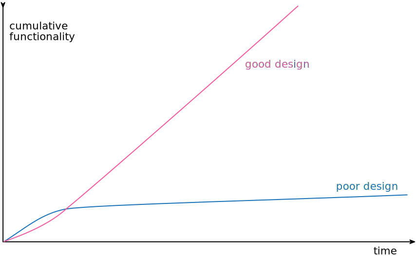

# Chapter 2 - Principles in Refactoring

## Defining Refactoring

__Refactoring__ (noun): a change made to the internal structure of software to make it easier to understand and cheaper
to modify without changing its observable behavior.

__Refactoring__ (verb): to restructure software by applying a series of refactorings without changing its observable
behavior.

[Canon TDD](https://tidyfirst.substack.com/p/canon-tdd) 를 할 때 테스트 시나리오 목록에서 구현할 순서를 정하는 것이 경험에서 우러나오는 중요한 스킬이라 하는데 이와 비슷한 맥락에서 작은 리팩토링 단계들을 엮어서 원하는 큰 구조 변경을 일으키는 노하우가 궁금하다.

## The Two Hats

When using refactoring to develop software, divide time between two distinct activities: adding functionality and refactoring.

## Why Should We Refactor?

- Refactoring improves the design of software
- Refactoring makes software easier to understand
- Refactoring helps me find bugs
- Refactoring helps me program faster

이 중 리팩토링이 프로그래밍 속도를 높인다는 것은 Design Stamina Hypothesis 이라고 부른다.

## When Should We Refactor?

- Preparatory refactoring--making it easier to add a feature
- Comprehension refactoring: making code easier to understand
- Litter-pickup refactoring
- Planned and opportunistic refactoring
- Long-term refactoring
- Refactoring in a code review
- What do I tell my manager?
- When should I not refactor?

## Problems with Refactoring

## Refactoring, Architecture, and Yagni

The real impact of refactoring on architecture is in how it can be used to form a well-designed code base that can respond gracefully to changing needs.

With refactoring, you can use refactoring to adapt the architecture to users' needs. This approach to design goes under various names: simple design, incremental design, or [yagni](https://martinfowler.com/bliki/Yagni.html).

## Refactoring and the Wider Software Development Process

## Refactoring and Performance

## Where Did Refactoring Come From?

## Automated Refactorings

To do refactoring properly, the tool has to operate on the syntax tree of the code, not on the text.

The tool also needs to figure out how to rerender the code into text back in the editor window.
